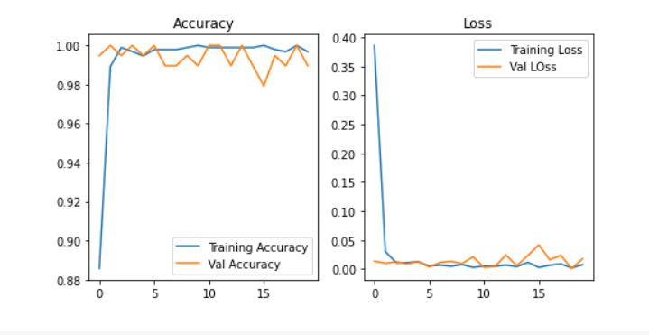

# Face Mask Detection
Face Mask Detection System built using Deep Learning and OpenCV to detect real time face masks.

## Feature of Face Mask Detection
Model use concept of Transfer Learning with Pre-trained MobileNetV2 model architecture.

Model can be used in real-time applications which require face-mask detection for safety purposes due to the outbreak of Covid-19. This project can be integrated with embedded systems for application at public places to ensure that public safety guidelines are followed.

The model is potential to predicting multiple faces with or without masks at the same time.

## Preview
<p>
<video width="320" height="240" controls autoplay src="Images/Mask Detection.mp4" type="video/mp4">
</video>
</p>

# Installations
Follow steps to use this project:

1. Clone repository
```
git clone https://github.com/YashBorikar/Mask-Detection.git
```
2. Change directory to clone repository

```
cd Mask-Detection
```
3. Create a Python virtual environment and activate it
```
$ virtualenv venv
```
```
$ source venv/bin/activate      # For Linux
$ venv\Scripts\activate         # For Windows
```
4. Install required libraries
```
pip install -r requirements.txt
```
# Getting Started
Run OpenCVMaskDetection.py
```
python OpenCVMaskDetection.py
```

# Results

<a href="https://colab.research.google.com/drive/1z0sIeiQrIKPRQnFpaXPoSrprgnU2dfje?usp=sharing"></a>

 Training Accuracy: 99.89%, Training Loss: 0.21%, Testing Accuracy: 99.48%, Testing Loss: 0.91%
<p>
  
</p>

Model gave 99% accuracy for Face Mask Detection after training
<p>
  
</p>


# Connect me
[](https://www.linkedin.com/in/yashborikar/)